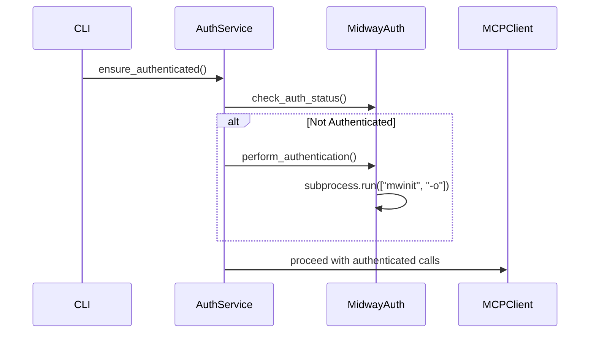
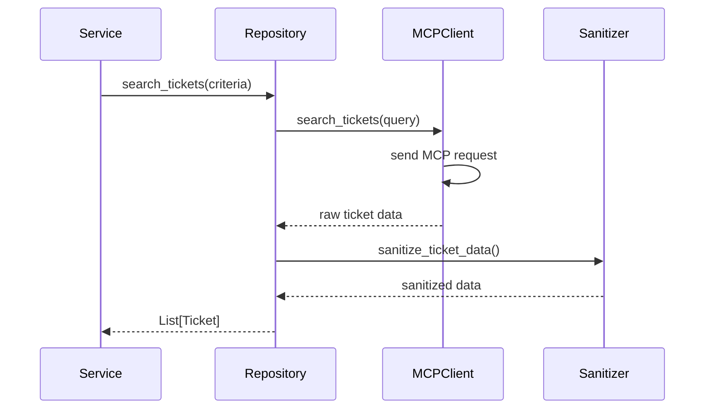
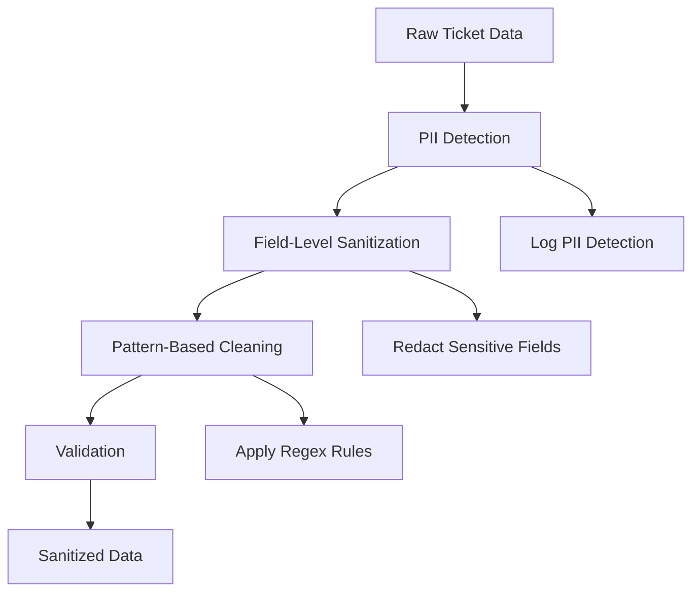

# Architecture Guide

## Overview

The Ticket Analysis CLI follows Clean Architecture principles with a layered approach that ensures separation of concerns, testability, and maintainability. The system integrates with Amazon's internal ticketing infrastructure through the Builder MCP (Model Context Protocol) to provide comprehensive ticket analysis and reporting capabilities.

## Architecture Layers

```
┌─────────────────────────────────────────────────────────────┐
│                CLI Layer (Presentation)                     │
│    ├── commands/                                            │
│    │   ├── analyze.py                                       │
│    │   └── report.py                                        │
│    └── Click framework with color-coded output              │
└─────────────────────┬───────────────────────────────────────┘
                      │
┌─────────────────────▼───────────────────────────────────────┐
│            Application Layer (Use Cases)                    │
│    ├── services/                                            │
│    │   ├── analysis_service.py                              │
│    │   └── report_service.py                                │
│    └── Orchestration & Workflow Management                  │
└─────────────────────┬───────────────────────────────────────┘
                      │
┌─────────────────────▼───────────────────────────────────────┐
│             Domain Layer (Business Logic)                   │
│    ├── models/                                              │
│    │   ├── ticket.py                                        │
│    │   └── analysis_result.py                               │
│    └── Core business rules and entities                     │
└─────────────────────┬───────────────────────────────────────┘
                      │
┌─────────────────────▼───────────────────────────────────────┐
│        Infrastructure Layer (External Concerns)             │
│    ├── repositories/                                        │
│    │   ├── mcp_ticket_repository.py                         │
│    │   └── file_repository.py                               │
│    └── external/                                            │
│        ├── mcp_client.py                                    │
│        └── auth_service.py                                  │
└─────────────────────────────────────────────────────────────┘
```

## Design Patterns

### Repository Pattern
Abstracts data access logic and provides a uniform interface for data operations.

```python
class TicketRepository(ABC):
    @abstractmethod
    def find_by_criteria(self, criteria: SearchCriteria) -> List[Ticket]:
        pass

class MCPTicketRepository(TicketRepository):
    def find_by_criteria(self, criteria: SearchCriteria) -> List[Ticket]:
        # MCP-specific implementation
        pass
```

### Strategy Pattern
Enables different analysis algorithms to be used interchangeably.

```python
class MetricsCalculator(ABC):
    @abstractmethod
    def calculate(self, tickets: List[Ticket]) -> Dict[str, Any]:
        pass

class ResolutionTimeCalculator(MetricsCalculator):
    def calculate(self, tickets: List[Ticket]) -> Dict[str, Any]:
        # Resolution time calculation logic
        pass
```

### Template Method Pattern
Defines the skeleton of report generation while allowing subclasses to override specific steps.

```python
class ReportGenerator(ABC):
    def generate_report(self, analysis: AnalysisResult) -> str:
        header = self._generate_header(analysis)
        summary = self._generate_summary(analysis)
        details = self._generate_details(analysis)
        return self._format_report(header, summary, details)
```

### Chain of Responsibility
Handles configuration loading from multiple sources with priority hierarchy.

```python
class ConfigurationHandler(ABC):
    def handle(self, key: str) -> Optional[Any]:
        result = self._get_config_value(key)
        if result is not None:
            return result
        if self._next_handler:
            return self._next_handler.handle(key)
        return None
```

### Circuit Breaker Pattern
Provides resilience for external service calls by preventing cascading failures.

```python
class CircuitBreaker:
    def call(self, func: Callable, *args, **kwargs) -> Any:
        if self._state == CircuitState.OPEN:
            raise CircuitBreakerOpenError("Circuit breaker is open")
        try:
            result = func(*args, **kwargs)
            self._on_success()
            return result
        except Exception as e:
            self._on_failure()
            raise e
```

## Component Interactions

### Data Flow

1. **CLI Layer** receives user input and validates arguments
2. **Application Layer** orchestrates the analysis workflow
3. **Domain Layer** contains business logic and rules
4. **Infrastructure Layer** handles external system interactions

### Authentication Flow



### Data Retrieval Flow



## Security Architecture

### Data Sanitization Pipeline



### Authentication Security

- **Subprocess Isolation**: Authentication commands run in isolated environment
- **Credential Protection**: No credentials stored or logged
- **Session Management**: Automatic session expiry and re-authentication
- **Timeout Handling**: Prevents hanging authentication processes

## Performance Considerations

### Optimization Strategies

1. **Connection Pooling**: Reuse MCP connections for multiple requests
2. **Circuit Breaker**: Prevent resource exhaustion from failing services
3. **Retry Logic**: Exponential backoff for transient failures
4. **Data Processing**: Use pandas for efficient large dataset operations
5. **Memory Management**: Stream processing for large result sets

### Scalability Limits

- **Dataset Size**: Optimized for up to 100,000 tickets
- **Memory Usage**: Linear scaling with input size
- **Processing Time**: ~1-2 seconds per 10,000 tickets
- **Concurrent Users**: Single-user CLI application

## Error Handling Strategy

### Exception Hierarchy

```python
TicketAnalysisError
├── AuthenticationError
│   └── AuthenticationTimeoutError
├── DataRetrievalError
├── ValidationError
├── AnalysisError
├── ReportGenerationError
├── ConfigurationError
└── MCPError
    ├── MCPConnectionError
    └── MCPTimeoutError
```

### Error Recovery

1. **Retry Logic**: Automatic retry for transient failures
2. **Circuit Breaker**: Fail fast for persistent issues
3. **Graceful Degradation**: Continue with partial data when possible
4. **User Feedback**: Clear error messages with actionable guidance

## Configuration Management

### Configuration Hierarchy

1. **Command Line Arguments** (Highest Priority)
2. **Configuration Files** (JSON/INI)
3. **Environment Variables**
4. **Default Values** (Lowest Priority)

### Configuration Sources

```python
# Example configuration structure
{
    "authentication": {
        "timeout_seconds": 60,
        "max_retry_attempts": 3
    },
    "output": {
        "default_format": "table",
        "max_results": 1000
    },
    "logging": {
        "level": "INFO",
        "sanitize_logs": true
    }
}
```

## Dependency Injection

### Container Pattern

```python
class DependencyContainer:
    def __init__(self):
        self._auth_service = self._create_auth_service()
        self._repository = self._create_repository()
        self._analysis_service = self._create_analysis_service()
    
    def get_analysis_service(self) -> AnalysisService:
        return self._analysis_service
```

### Service Lifecycle

- **Singleton**: Configuration, authentication services
- **Transient**: Report generators, calculators
- **Scoped**: Analysis sessions, data processors

## Testing Architecture

### Test Pyramid

```
    ┌─────────────────┐
    │   E2E Tests     │  ← CLI integration tests
    ├─────────────────┤
    │ Integration     │  ← Service integration tests
    │     Tests       │
    ├─────────────────┤
    │   Unit Tests    │  ← Component unit tests
    └─────────────────┘
```

### Mock Strategy

- **External Services**: Mock MCP client, authentication
- **File System**: Mock file operations for testing
- **Time**: Mock datetime for consistent test results
- **Network**: Mock subprocess calls and network requests

## Deployment Architecture

### Package Structure

```
ticket-analyzer/
├── ticket_analyzer/          # Main package
│   ├── cli/                 # CLI commands
│   ├── models/              # Domain models
│   ├── services/            # Application services
│   ├── repositories/        # Data access
│   ├── external/            # External integrations
│   ├── config/              # Configuration
│   ├── auth/                # Authentication
│   ├── analysis/            # Analysis engine
│   ├── reporting/           # Report generation
│   └── security/            # Security components
├── tests/                   # Test suite
├── docs/                    # Documentation
└── examples/                # Usage examples
```

### Runtime Dependencies

- **Python 3.7+**: Core runtime
- **Node.js 16+**: MCP server components
- **System Tools**: mwinit for authentication
- **Network Access**: Amazon internal network

## Extension Points

### Custom Calculators

Implement `MetricsCalculator` interface to add new analysis types:

```python
class CustomCalculator(MetricsCalculator):
    def calculate(self, tickets: List[Ticket]) -> Dict[str, Any]:
        # Custom calculation logic
        pass
```

### Custom Report Formats

Implement `ReportingInterface` to add new output formats:

```python
class CustomReportGenerator(ReportingInterface):
    def generate_report(self, data: Dict[str, Any], output_path: str) -> str:
        # Custom report generation
        pass
```

### Custom Data Sources

Implement `DataRetrievalInterface` to add new data sources:

```python
class CustomRepository(DataRetrievalInterface):
    def search_tickets(self, criteria: SearchCriteria) -> List[Ticket]:
        # Custom data retrieval logic
        pass
```

## Monitoring and Observability

### Logging Strategy

- **Structured Logging**: JSON format for production
- **Log Levels**: DEBUG, INFO, WARNING, ERROR
- **Sanitization**: Automatic PII removal from logs
- **Rotation**: Automatic log file rotation

### Metrics Collection

- **Performance Metrics**: Processing time, memory usage
- **Error Metrics**: Error rates, failure types
- **Usage Metrics**: Command usage, feature adoption
- **Health Metrics**: Service availability, response times

## Future Architecture Considerations

### Scalability Improvements

1. **Microservices**: Split into separate analysis and reporting services
2. **Caching**: Add Redis for frequently accessed data
3. **Queue Processing**: Async processing for large datasets
4. **Load Balancing**: Distribute analysis across multiple instances

### Technology Evolution

1. **Python Version**: Upgrade to Python 3.9+ for performance improvements
2. **Async Processing**: Add asyncio for concurrent operations
3. **Database**: Add persistent storage for historical analysis
4. **API Gateway**: REST API for programmatic access

This architecture provides a solid foundation for the current requirements while maintaining flexibility for future enhancements and scalability needs.