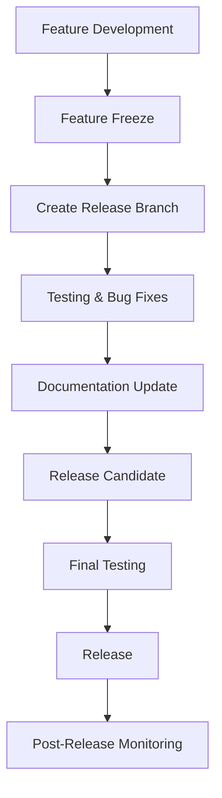
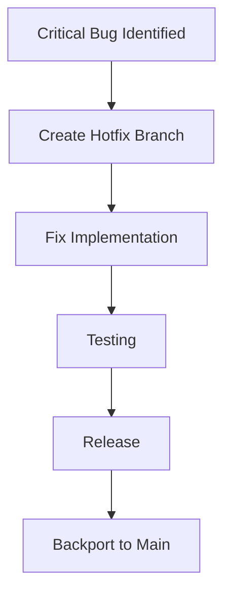

# Release Process and Version Management

## Overview

This document outlines the release process, version management strategy, and deployment procedures for the Ticket Analysis CLI tool. It ensures consistent, reliable releases with proper testing and documentation.

## Version Management Strategy

### Semantic Versioning (SemVer)

We follow Semantic Versioning 2.0.0 (https://semver.org/):

```
MAJOR.MINOR.PATCH[-PRERELEASE][+BUILD]

Examples:
1.0.0        - Initial release
1.1.0        - New features, backwards compatible
1.1.1        - Bug fixes, backwards compatible
2.0.0        - Breaking changes
1.2.0-alpha.1 - Pre-release version
1.2.0+20240115 - Build metadata
```

#### Version Components

- **MAJOR**: Incompatible API changes, breaking changes
- **MINOR**: New functionality, backwards compatible
- **PATCH**: Bug fixes, backwards compatible
- **PRERELEASE**: Alpha, beta, rc (release candidate)
- **BUILD**: Build metadata, commit hash, date

#### Version Increment Guidelines

| Change Type | Version Bump | Examples |
|-------------|--------------|----------|
| Breaking API changes | MAJOR | Remove CLI options, change output format |
| New features | MINOR | Add new commands, new analysis types |
| Bug fixes | PATCH | Fix authentication issues, resolve crashes |
| Security fixes | PATCH | Fix vulnerabilities, security improvements |
| Documentation | None | Update README, add examples |
| Internal refactoring | None | Code cleanup, performance improvements |

### Version File Management

#### Version Configuration

```python
# ticket_analyzer/__init__.py
__version__ = "1.2.3"
__version_info__ = (1, 2, 3)

# pyproject.toml
[project]
name = "ticket-analyzer"
version = "1.2.3"
description = "CLI tool for analyzing Amazon internal ticket data"

# setup.py (if used)
from ticket_analyzer import __version__

setup(
    name="ticket-analyzer",
    version=__version__,
    # ... other configuration
)
```

#### Automated Version Management

```bash
#!/bin/bash
# scripts/bump-version.sh
set -e

CURRENT_VERSION=$(python -c "from ticket_analyzer import __version__; print(__version__)")
echo "Current version: $CURRENT_VERSION"

# Parse version components
IFS='.' read -r -a VERSION_PARTS <<< "$CURRENT_VERSION"
MAJOR=${VERSION_PARTS[0]}
MINOR=${VERSION_PARTS[1]}
PATCH=${VERSION_PARTS[2]}

case "$1" in
    major)
        NEW_VERSION="$((MAJOR + 1)).0.0"
        ;;
    minor)
        NEW_VERSION="$MAJOR.$((MINOR + 1)).0"
        ;;
    patch)
        NEW_VERSION="$MAJOR.$MINOR.$((PATCH + 1))"
        ;;
    *)
        echo "Usage: $0 {major|minor|patch}"
        exit 1
        ;;
esac

echo "New version: $NEW_VERSION"

# Update version files
sed -i "s/__version__ = \".*\"/__version__ = \"$NEW_VERSION\"/" ticket_analyzer/__init__.py
sed -i "s/version = \".*\"/version = \"$NEW_VERSION\"/" pyproject.toml

echo "Version updated to $NEW_VERSION"
```

## Release Workflow

### Release Types

#### 1. Regular Release (Minor/Major)



#### 2. Hotfix Release (Patch)



### Release Branch Strategy

#### Branch Naming Convention

```bash
# Release branches
release/v1.2.0
release/v2.0.0

# Hotfix branches
hotfix/v1.1.1-auth-fix
hotfix/v1.1.2-security-patch

# Pre-release branches
release/v1.2.0-rc.1
release/v2.0.0-beta.1
```

#### Release Branch Workflow

```bash
# 1. Create release branch from main
git checkout main
git pull origin main
git checkout -b release/v1.2.0

# 2. Update version numbers
./scripts/bump-version.sh minor

# 3. Update changelog
# Edit CHANGELOG.md with release notes

# 4. Commit version changes
git add .
git commit -m "chore(release): bump version to 1.2.0"

# 5. Push release branch
git push origin release/v1.2.0

# 6. Create release PR
# Open PR from release/v1.2.0 to main
```

## Release Checklist

### Pre-Release Checklist

#### Code Quality
- [ ] All tests pass (unit, integration, security)
- [ ] Code coverage meets minimum threshold (80%)
- [ ] No critical security vulnerabilities
- [ ] Performance benchmarks within acceptable ranges
- [ ] Documentation is up to date

#### Version Management
- [ ] Version number updated in all files
- [ ] CHANGELOG.md updated with release notes
- [ ] Breaking changes documented
- [ ] Migration guide created (if needed)

#### Testing
- [ ] Manual testing completed
- [ ] Integration tests with real MCP services
- [ ] Authentication flow tested
- [ ] CLI commands tested across platforms
- [ ] Performance testing completed

#### Documentation
- [ ] README updated
- [ ] API documentation current
- [ ] Installation instructions verified
- [ ] Examples and tutorials updated
- [ ] Security guidelines reviewed

### Release Execution Checklist

#### Release Preparation
- [ ] Release branch created and tested
- [ ] Release notes prepared
- [ ] Deployment scripts tested
- [ ] Rollback procedures verified
- [ ] Stakeholders notified

#### Release Deployment
- [ ] Tag created with proper version
- [ ] Package built and tested
- [ ] Distribution packages created
- [ ] Release published
- [ ] Documentation deployed

#### Post-Release
- [ ] Release announcement sent
- [ ] Monitoring alerts configured
- [ ] Performance metrics baseline updated
- [ ] Support team notified
- [ ] Next release planning initiated

## Release Automation

### GitHub Actions Workflow

```yaml
# .github/workflows/release.yml
name: Release

on:
  push:
    tags:
      - 'v*'

jobs:
  test:
    runs-on: ubuntu-latest
    strategy:
      matrix:
        python-version: [3.7, 3.8, 3.9]
    
    steps:
    - uses: actions/checkout@v3
    
    - name: Set up Python ${{ matrix.python-version }}
      uses: actions/setup-python@v4
      with:
        python-version: ${{ matrix.python-version }}
    
    - name: Install dependencies
      run: |
        python -m pip install --upgrade pip
        pip install -r requirements-dev.txt
    
    - name: Run tests
      run: |
        pytest --cov=ticket_analyzer --cov-report=xml
    
    - name: Upload coverage
      uses: codecov/codecov-action@v3

  build:
    needs: test
    runs-on: ubuntu-latest
    
    steps:
    - uses: actions/checkout@v3
    
    - name: Set up Python
      uses: actions/setup-python@v4
      with:
        python-version: 3.7
    
    - name: Install build dependencies
      run: |
        python -m pip install --upgrade pip
        pip install build twine
    
    - name: Build package
      run: python -m build
    
    - name: Check package
      run: twine check dist/*
    
    - name: Upload artifacts
      uses: actions/upload-artifact@v3
      with:
        name: dist
        path: dist/

  release:
    needs: build
    runs-on: ubuntu-latest
    
    steps:
    - uses: actions/checkout@v3
    
    - name: Download artifacts
      uses: actions/download-artifact@v3
      with:
        name: dist
        path: dist/
    
    - name: Create Release
      uses: actions/create-release@v1
      env:
        GITHUB_TOKEN: ${{ secrets.GITHUB_TOKEN }}
      with:
        tag_name: ${{ github.ref }}
        release_name: Release ${{ github.ref }}
        body_path: RELEASE_NOTES.md
        draft: false
        prerelease: false
    
    - name: Upload Release Assets
      uses: actions/upload-release-asset@v1
      env:
        GITHUB_TOKEN: ${{ secrets.GITHUB_TOKEN }}
      with:
        upload_url: ${{ steps.create_release.outputs.upload_url }}
        asset_path: dist/
        asset_name: ticket-analyzer-dist
        asset_content_type: application/zip
```

### Automated Release Script

```bash
#!/bin/bash
# scripts/release.sh
set -e

VERSION_TYPE="$1"
if [ -z "$VERSION_TYPE" ]; then
    echo "Usage: $0 {major|minor|patch}"
    exit 1
fi

echo "Starting $VERSION_TYPE release process..."

# Ensure we're on main branch
CURRENT_BRANCH=$(git branch --show-current)
if [ "$CURRENT_BRANCH" != "main" ]; then
    echo "Error: Must be on main branch for release"
    exit 1
fi

# Ensure working directory is clean
if [ -n "$(git status --porcelain)" ]; then
    echo "Error: Working directory is not clean"
    exit 1
fi

# Pull latest changes
git pull origin main

# Run tests
echo "Running tests..."
pytest

# Bump version
echo "Bumping version..."
./scripts/bump-version.sh "$VERSION_TYPE"

NEW_VERSION=$(python -c "from ticket_analyzer import __version__; print(__version__)")
echo "New version: $NEW_VERSION"

# Update changelog
echo "Please update CHANGELOG.md with release notes for version $NEW_VERSION"
read -p "Press enter when changelog is updated..."

# Create release branch
RELEASE_BRANCH="release/v$NEW_VERSION"
git checkout -b "$RELEASE_BRANCH"

# Commit version changes
git add .
git commit -m "chore(release): bump version to $NEW_VERSION"

# Push release branch
git push origin "$RELEASE_BRANCH"

# Create tag
git tag -a "v$NEW_VERSION" -m "Release version $NEW_VERSION"
git push origin "v$NEW_VERSION"

echo "Release $NEW_VERSION created successfully!"
echo "Next steps:"
echo "1. Create PR from $RELEASE_BRANCH to main"
echo "2. Review and merge PR"
echo "3. Monitor release deployment"
```

## Changelog Management

### Changelog Format

```markdown
# Changelog

All notable changes to this project will be documented in this file.

The format is based on [Keep a Changelog](https://keepachangelog.com/en/1.0.0/),
and this project adheres to [Semantic Versioning](https://semver.org/spec/v2.0.0.html).

## [Unreleased]

### Added
- New ticket analysis metrics
- Enhanced error handling

### Changed
- Improved authentication flow
- Updated dependencies

### Fixed
- Resolved CLI argument parsing issue
- Fixed data sanitization bug

### Security
- Enhanced input validation
- Improved credential handling

## [1.2.0] - 2024-01-15

### Added
- MCP integration for ticket retrieval
- Comprehensive data sanitization
- CLI progress indicators
- HTML report generation with charts

### Changed
- Refactored authentication system
- Improved error messages
- Updated configuration format

### Fixed
- Authentication timeout issues
- Memory leak in data processing
- CLI output formatting

### Security
- Added PII detection and removal
- Enhanced input validation
- Secure temporary file handling

## [1.1.0] - 2024-01-01

### Added
- Basic ticket analysis functionality
- CLI interface with Click framework
- Authentication support
- JSON and CSV output formats

### Fixed
- Initial bug fixes and improvements

## [1.0.0] - 2023-12-15

### Added
- Initial release
- Core ticket analysis features
- Basic CLI interface
- Authentication integration
```

### Automated Changelog Generation

```bash
#!/bin/bash
# scripts/generate-changelog.sh
set -e

LAST_TAG=$(git describe --tags --abbrev=0 2>/dev/null || echo "")
if [ -z "$LAST_TAG" ]; then
    echo "No previous tags found, generating full changelog"
    COMMIT_RANGE="HEAD"
else
    echo "Generating changelog since $LAST_TAG"
    COMMIT_RANGE="$LAST_TAG..HEAD"
fi

echo "## [Unreleased]"
echo ""

# Added features
echo "### Added"
git log $COMMIT_RANGE --oneline --grep="^feat" --pretty=format:"- %s" | sed 's/^feat[^:]*: //'
echo ""

# Changed features  
echo "### Changed"
git log $COMMIT_RANGE --oneline --grep="^refactor\|^perf" --pretty=format:"- %s" | sed 's/^[^:]*: //'
echo ""

# Fixed issues
echo "### Fixed"
git log $COMMIT_RANGE --oneline --grep="^fix" --pretty=format:"- %s" | sed 's/^fix[^:]*: //'
echo ""

# Security updates
echo "### Security"
git log $COMMIT_RANGE --oneline --grep="security\|vulnerability" --pretty=format:"- %s"
echo ""
```

## Hotfix Process

### Hotfix Workflow

```bash
#!/bin/bash
# scripts/hotfix.sh
set -e

HOTFIX_VERSION="$1"
if [ -z "$HOTFIX_VERSION" ]; then
    echo "Usage: $0 <patch_version>"
    echo "Example: $0 1.1.1"
    exit 1
fi

echo "Creating hotfix for version $HOTFIX_VERSION..."

# Create hotfix branch from latest release tag
LATEST_TAG=$(git describe --tags --abbrev=0)
git checkout "$LATEST_TAG"
git checkout -b "hotfix/v$HOTFIX_VERSION"

# Make necessary changes
echo "Make your hotfix changes now..."
read -p "Press enter when changes are complete..."

# Update version
sed -i "s/__version__ = \".*\"/__version__ = \"$HOTFIX_VERSION\"/" ticket_analyzer/__init__.py
sed -i "s/version = \".*\"/version = \"$HOTFIX_VERSION\"/" pyproject.toml

# Run tests
pytest

# Commit changes
git add .
git commit -m "hotfix: version $HOTFIX_VERSION"

# Create tag
git tag -a "v$HOTFIX_VERSION" -m "Hotfix version $HOTFIX_VERSION"

# Push hotfix
git push origin "hotfix/v$HOTFIX_VERSION"
git push origin "v$HOTFIX_VERSION"

# Merge back to main
git checkout main
git merge "hotfix/v$HOTFIX_VERSION"
git push origin main

echo "Hotfix $HOTFIX_VERSION completed!"
```

## Release Communication

### Release Notes Template

```markdown
# Release v1.2.0

## 🎉 What's New

### Major Features
- **Enhanced MCP Integration**: Improved connection handling and error recovery
- **Advanced Analytics**: New metrics for team performance analysis
- **Security Improvements**: Enhanced PII detection and data sanitization

### CLI Improvements
- Added progress indicators for long-running operations
- Improved error messages with actionable suggestions
- New `--dry-run` option for testing configurations

### Performance Enhancements
- 40% faster data processing for large datasets
- Reduced memory usage by 25%
- Optimized authentication flow

## 🐛 Bug Fixes
- Fixed authentication timeout issues (#123)
- Resolved CLI argument parsing edge cases (#145)
- Fixed memory leak in report generation (#167)

## 🔒 Security Updates
- Enhanced input validation to prevent injection attacks
- Improved credential handling and storage
- Added audit logging for security events

## 📚 Documentation
- Updated installation guide with troubleshooting tips
- Added performance tuning recommendations
- Expanded API documentation with examples

## 🚀 Upgrade Instructions

### Breaking Changes
None in this release.

### Installation
```bash
pip install --upgrade ticket-analyzer==1.2.0
```

### Configuration Updates
No configuration changes required.

## 📊 Metrics
- **Tests**: 847 tests, 94% coverage
- **Performance**: 2.3s average analysis time (1000 tickets)
- **Security**: 0 critical vulnerabilities

## 🙏 Contributors
Thanks to all contributors who made this release possible!

## 📞 Support
For issues or questions, please:
- Check the [documentation](docs/)
- Search [existing issues](issues/)
- Create a [new issue](issues/new)

---
**Full Changelog**: [v1.1.0...v1.2.0](compare/v1.1.0...v1.2.0)
```

This comprehensive release process ensures consistent, reliable releases with proper testing, documentation, and communication throughout the development lifecycle.